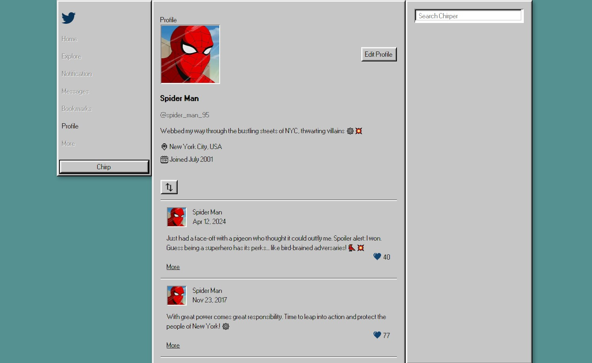
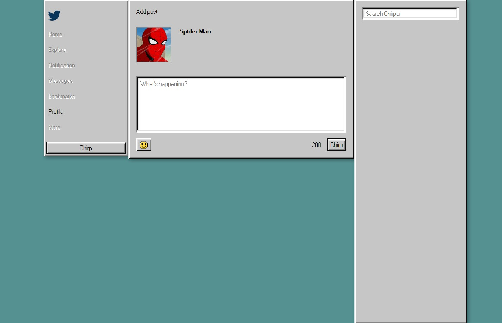
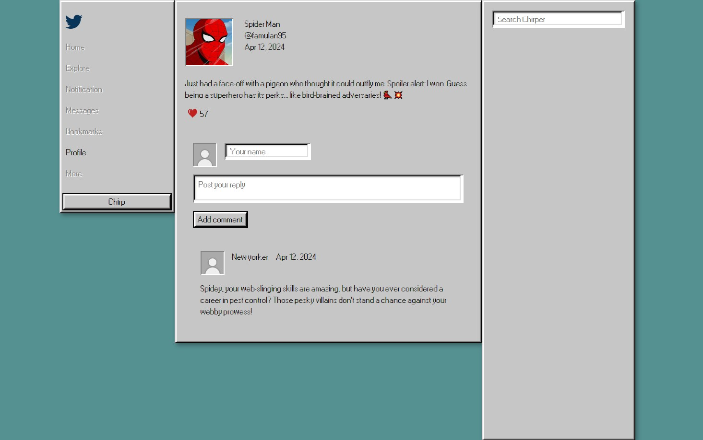
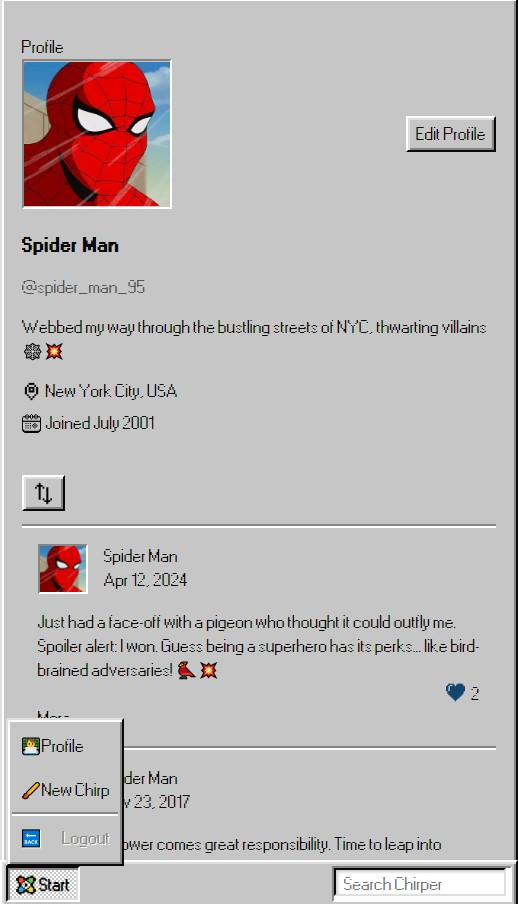

# Twitter clone

This is a clone of Twitter, built using [the Windows 95](https://github.com/react95-io) style UI component library for React and React Native.

The Firebase Realtime Database is used to store and retrieve data.

Live - https://chirper-new.web.app/

## Features:

- View the main page, which contains all the posts.
- Sorting tweets.
- View the post individually.
- Tweeting: you can post tweets and add emojy.
- Comments: you can post comments.
- Responsive Design: optimized for viewing on both desktop and mobile devices.
